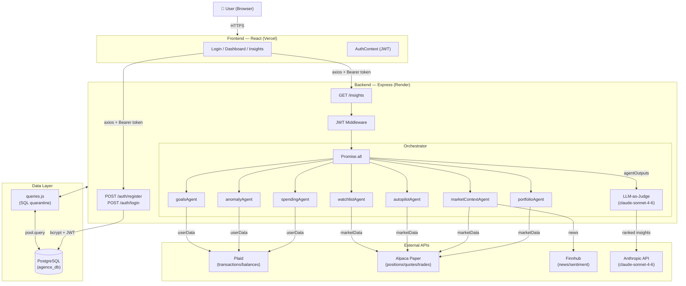

# Agence

AI-powered personal finance and investment copilot. Parallel agents analyze spending, anomalies, savings goals, portfolio health, and market context. An LLM-as-judge layer synthesizes all agent outputs into a single ranked insight feed.

## What It Does

- Connects bank accounts via Plaid (transactions, balances)
- Connects paper trading account via Alpaca (positions, quotes, trade execution)
- Runs 7 analysis agents in parallel — spending, anomalies, goals, portfolio, market context, autopilot, watchlist
- Synthesizes insights via `claude-sonnet-4-6` LLM-as-judge with explicit scoring dimensions
- Supports autopilot paper trading with configurable rules

## Tech Stack

| Layer | Technology |
|---|---|
| Frontend | React (functional components) |
| Backend | Node.js + Express |
| Database | PostgreSQL |
| Auth | JWT |
| LLM | Anthropic Claude (`claude-sonnet-4-6`) |
| Testing | Jest + Supertest |

## API Responsibility Map

| API | Role |
|---|---|
| Plaid | Bank transactions and balances only |
| Alpaca | Portfolio positions, quotes, paper trade execution |
| Finnhub | News articles and sentiment scoring only |
| Anthropic | LLM-as-judge insight synthesis |

## Project Structure

```
server/
  agents/           # Pure analysis functions — (userData, marketData) => insights[]
  orchestrator/     # Parallel agent runner (Promise.all) + LLM-as-judge
  routes/           # Express API routes (/api/v1/:resource)
  db/               # All DB queries via queries.js — no SQL anywhere else
  middleware/       # JWT auth, error handling
client/
  src/              # React frontend
docs/               # PRD, HW documentation
project-memory/     # Progress tracking, architectural decisions, batch-fixes log
```

## Setup

```bash
# Install dependencies
cd server && npm install
cd ../client && npm install

# Configure environment
cp server/.env.example server/.env
# Fill in: DATABASE_URL, JWT_SECRET, PLAID_*, ALPACA_*, FINNHUB_API_KEY, ANTHROPIC_API_KEY

# Run development server
cd server && npm run dev
```

## Commands

```bash
cd server
npm run dev        # Express + nodemon
npm run lint       # ESLint — must pass clean before every commit
npm test           # Jest — must pass clean before every commit
npm run test:watch # TDD mode
```

## Architecture Diagram



## Architecture Notes

- **Agent purity** — agents are pure functions with no side effects, no DB calls, no API calls
- **Parallel execution** — orchestrator runs all agents via `Promise.all`, never sequentially
- **SQL quarantine** — all queries go through `server/db/queries.js`, zero exceptions
- **Paper trading only** — `ALPACA_PAPER=true` is hardcoded and never toggled off

## Live Deployment

| | URL |
|---|---|
| Frontend | https://agence-flame.vercel.app |
| Backend API | https://cs7180-project3-agence.onrender.com |
| Health check | https://cs7180-project3-agence.onrender.com/health |

## Connecting a Bank Account (Plaid Sandbox)

Agence uses Plaid in sandbox mode — no real bank credentials required.

1. Log in and go to **Account → Settings**
2. Click **Connect a bank account** — the Plaid Link modal opens
3. Search for any institution (e.g. "Chase") and select it
4. Enter the sandbox credentials:
   - **Username:** `user_good`
   - **Password:** `pass_good` <!-- pragma: allowlist secret -->
5. Select any account and complete the flow
6. Return to Settings — your linked accounts will appear
7. Optionally select an **active account** to filter transactions and insights to that account only

After linking, go to **Insights** and click **Refresh** to run all 6 agents against your sandbox transactions. The Dashboard will reflect your balances and the AI insight feed will populate within a few seconds.

> Note: Plaid sandbox transactions are pre-populated test data — they won't reflect any real spending.

## Connecting a Paper Trading Account (Alpaca)

Alpaca is connected server-side via environment variables — users do not configure Alpaca credentials. The app always uses Alpaca's paper trading environment (`ALPACA_PAPER=true` is hardcoded). To test portfolio features, place a paper trade on the **Portfolio** page.

## Status

- **246/246 tests passing** (Jest unit + integration)
- **4/4 E2E tests passing** (Playwright, live Vercel URL)
- **Coverage**: ~95% statements, 70%+ enforced in CI
- CI: GitHub Actions (lint → test → coverage → build → security → E2E → AI review)

See `project-memory/progress.md` for current build state and next steps.
